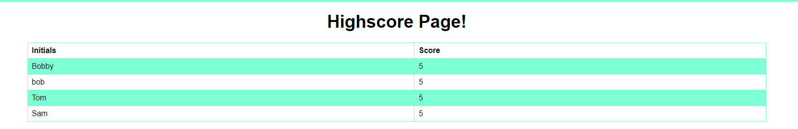

## Timed Quiz


For this assiment I had to make a timed quiz from scrath and use the web-api. 

- [The HTML](#the-html)
- [The CSS](#the-css)
- [The javaScript](#the-javascript)

# The HTML

I did a basic html file with a header and a heading. I added a start button and five hidden lists that contaion the answers.

```html
body>
    <header>
        <a href="./high-score.html">See Highscore</a>
        <p>Time: <span id="timer">/timer placeholder/</span></p>
    </header>

    <main id="main">
        <h1 id="quiz">Quiz</h1>
        <!-- the answer blocks -->

        <button type="button" id="start">Start?</button>

        <ul id="one">
            <li>
                <button type="button" data-state="correct">Yes</button>
            </li>
            <li>
                <button type="button" data-state="wrong">No</button>
            </li>
        </ul>
```

# The CSS



I did a basic styling of the html to out line the heading and the table.

# The javaScript

I created two scripts for this project. One for the index.html and another for the highscore page. First thing I did was make an array of questions to use for the quiz.

```javascript
var question = [
    "Does a var create a variable",
    "What is one way of making a loop?",
    "Can you make a button with out JS?",
    "Is jQuary needed to make websites?",
    "Can you do without BootStrap?"
]
```

Then I created function to check the current list and change to the next. 

```javascript
function startQuiz() {
    document.getElementById("start").style.display = "none";
    document.getElementById("one").style.display = "block";
    changeH1(0);
}

function nextQuestion(x, y) {
    document.getElementById(x).style.display = "none";
    document.getElementById(y).style.display = "block";
}

function changeH1(x) {
    document.getElementById("quiz").textContent = question[x];
}

function checkCurrentList() {
    var listOne = document.getElementById("one");
    var listTwo = document.getElementById("two");
    var listThree = document.getElementById("three");
    var listFour = document.getElementById("four");

    if (listOne.style.display === "block") {
        nextQuestion("one", "two");
        changeH1(1);
    } else if (listTwo.style.display === "block") {
        nextQuestion("two", "three");
        changeH1(2);
    } else if (listThree.style.display === "block") {
        nextQuestion("three", "four")
        changeH1(3);
    } else if (listFour.style.display === "block") {
        nextQuestion("four", "five");
        changeH1(4);
    } else {
        nextQuestion("five", "inputName");
        document.getElementById("indecator").textContent = "Input your initials.";
        document.getElementById("indecator").style.borderTop = "none"
        document.getElementById("quiz").textContent = "";
        clearInterval(timer);

    }
}
```
I next created a function that will add and subtract from the score and call the previous mentioned functions.

```javascript
function checkAnswer(event) {
    var target = event.target;
    var state = target.getAttribute("data-state");

    if (state != null) {
        if (state === "correct") {
            document.getElementById("indecator").textContent = state;
            score += 1;
            checkCurrentList();
        } else {
            document.getElementById("indecator").textContent = state;
            score -= 5;
            checkCurrentList();
        }
    }

    if (target != "button") {
        return
    }
}
```

The last thing I did for this file was to add event listeners and start the timer.

```javascript
start.addEventListener("click", function () {
    startQuiz();
    timer = setInterval(function () {
        if (time >= 0) {
            document.getElementById("timer").innerHTML = time;
            time--;
        } else {
            var ulEls = document.querySelectorAll("ul");
            for (var i = 0; i < ulEls.length; i++) {
                ulEls[i].style.display = "none";
            }
            nextQuestion("five", "inputName");
            document.getElementById("indecator").textContent = "Input your initials.";
            document.getElementById("indecator").style.borderTop = "none"
            document.getElementById("quiz").textContent = "";
            clearInterval(timer);
        }
    }, 1000);
});


mainEl.addEventListener("click", checkAnswer);
form.addEventListener("click", function () {
    var name = document.getElementById("initials").value;
    localStorage.setItem(name, score);
    location.href='./high-score.html';
});
```

For the HighScroe table I made a function that iterantes throgh the local storage and puts it into an html table. 

```javascript
function highscoreTable() {
    for (var i = 0; i < localStorage.length; i++) {
        console.log("test3");
        var table = document.getElementById("highscoreTable");
        var keys = localStorage.key(i);
        var values = localStorage[keys];
        var newRow = document.createElement("tr");
        var valueOne = document.createElement("td");
        var valueTwo = document.createElement("td");
        valueOne.innerHTML = keys;
        newRow.appendChild(valueOne);
        valueTwo.innerText = values;
        newRow.appendChild(valueOne);
        newRow.appendChild(valueTwo);
        table.appendChild(newRow);
    }
}

if (localStorage) {
    highscoreTable();
}
```